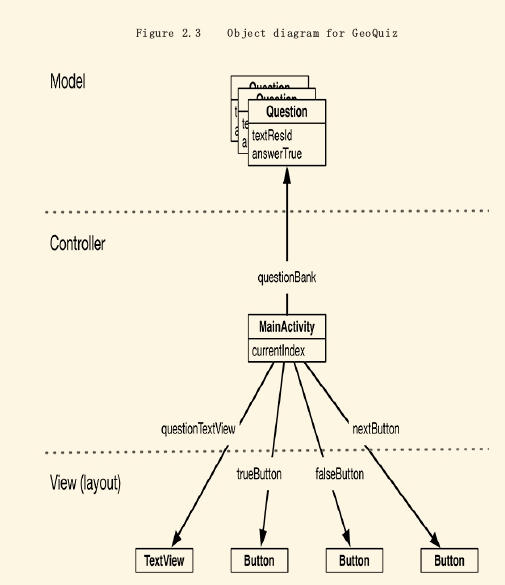
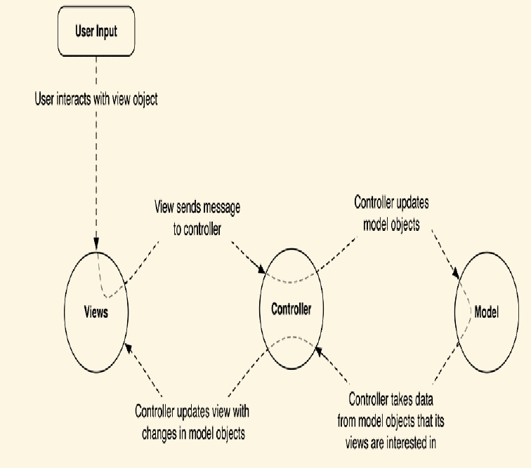

# MVC Model-View-Controller 

## MVC

- `Model`

    It hold the application's data and "business logic." 

- `View`

    It know how to draw themselves on the screen and how to respond to user input, like touches. 

- `Controller`

    It tie the view and model objects together ,They contain "Application logic" . It is typically a subclass of `Activity` or `Fragment`
    
          

## MVC FLOW
