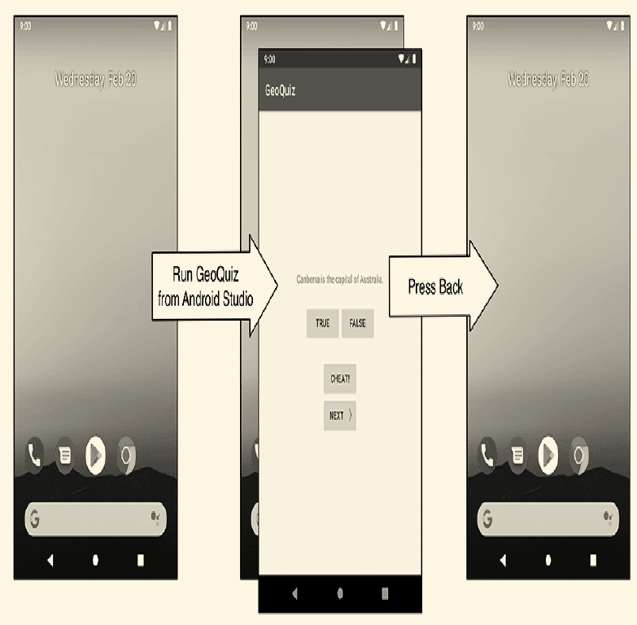

# Android activity 

## Start new activity from an activity 

- `public void startActivity(Intent intent)`

The argument `intent` is a media tool that component communicate with OS 

Activity and its child activity communicated some values using it .

## Understanding of using and managing activities 

`Activity manager` is responsible for lanuching activities and managing activities.

It Maintain a `stack`. This stack used for managing activities.When you open an application. The launcher activity instance will be pushed in this stack , when you click some button. The app will create a new activity and show another UI , This time, the new activity instance will be pushed in this stack. When you press `BACK` button. The origin pages will redisplay,And this time , the child activity will be poped in this stacked 

